# :icon-image: Imágenes de los ensayos de This Is It

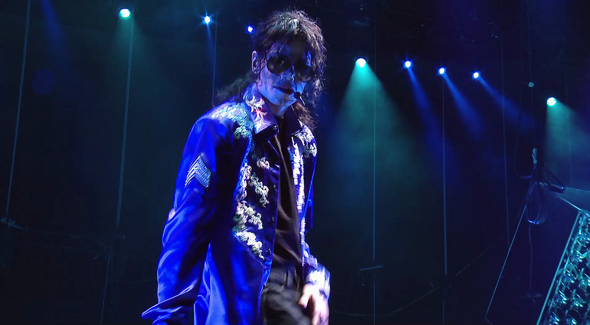

*Billie Jean.*

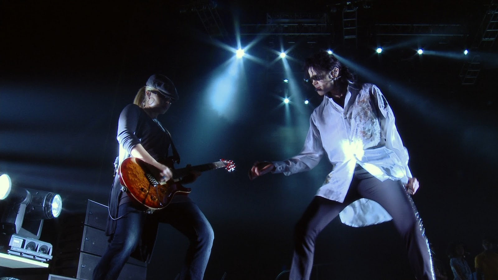

*Black Or White.*

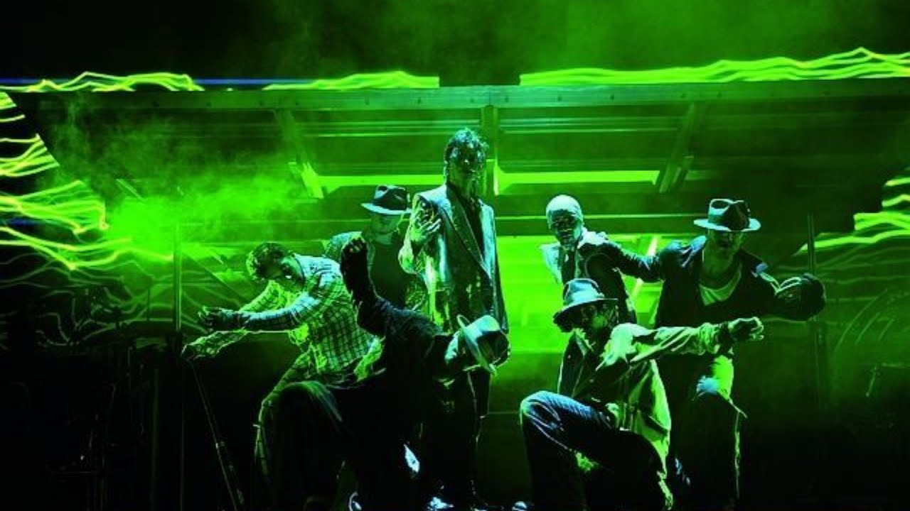

*Dangerous.*

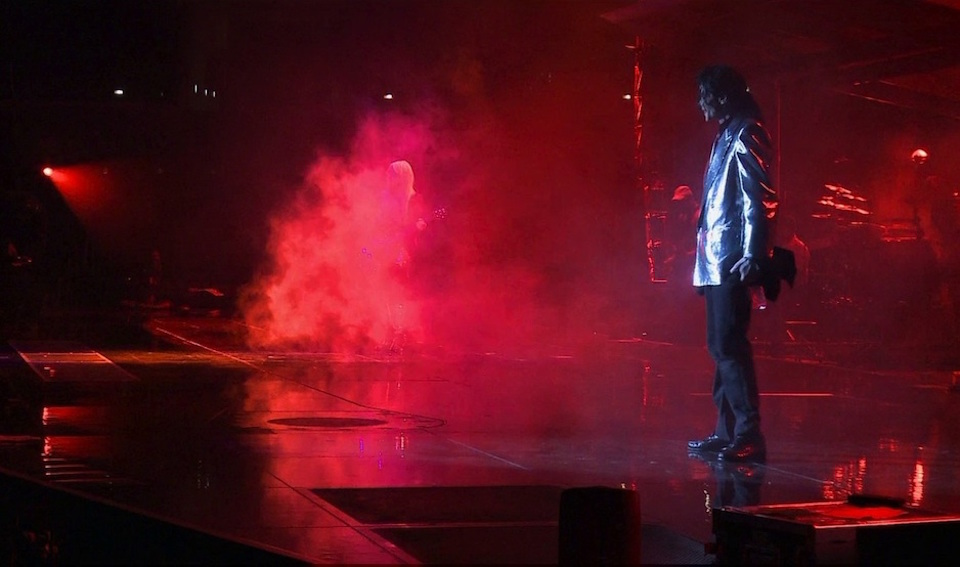

*Dirty Diana.*

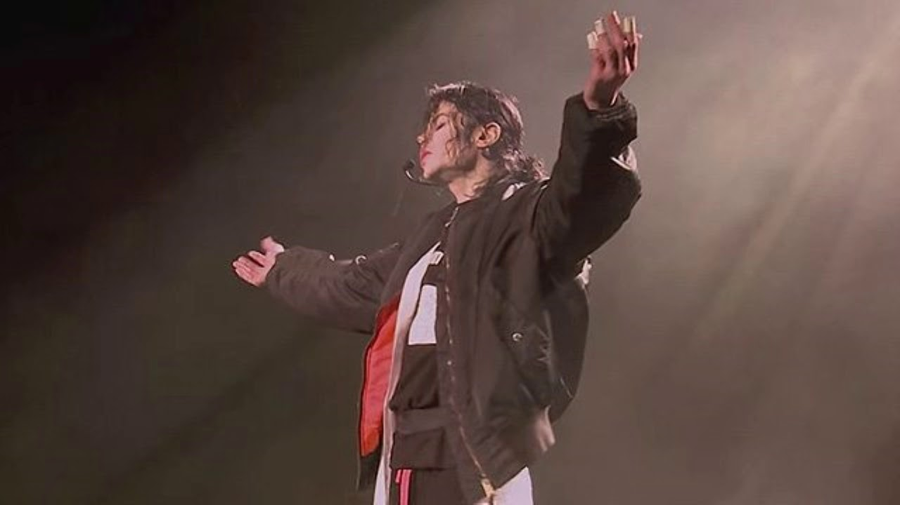

*Earth Song.*

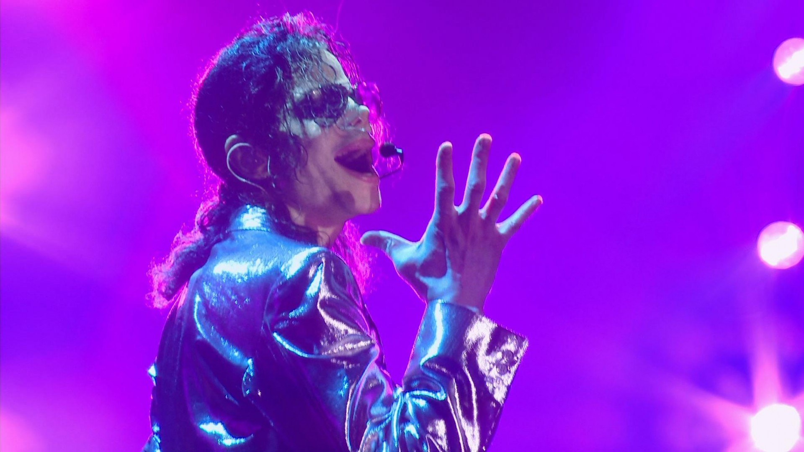

*Human Nature.*

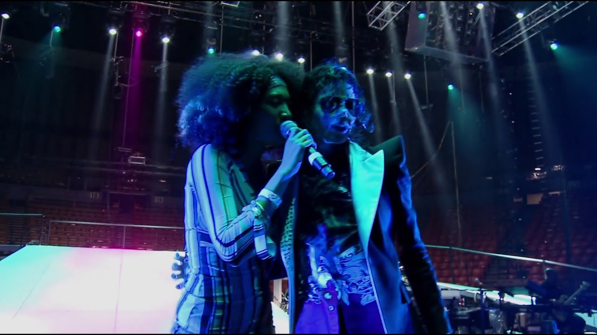

*I Just Can't Stop Loving You.*

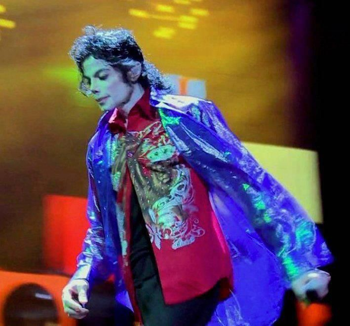

*Jackson 5 Medley.*

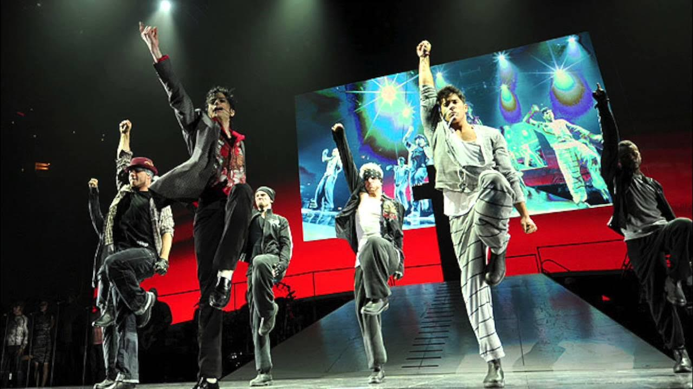

*Jam.*

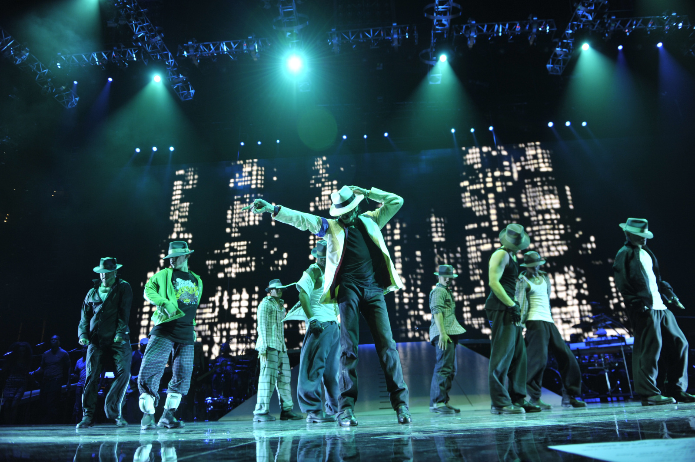

*Smooth Criminal.*

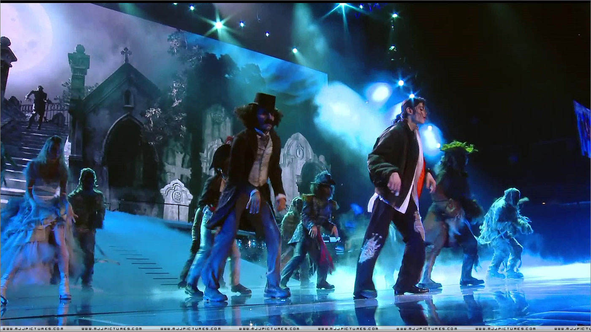

*Thriller/Threatened.*

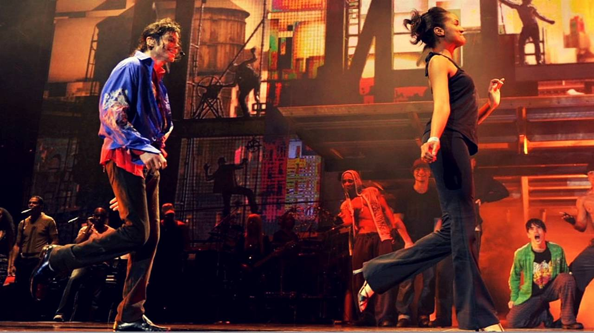

*The Way You Make Me Feel.*

*Estas son solo algunas de las muchas imágenes que existen de los ensayos de This Is It.*
Te animo a que explores más a fondo este material para que tengas una mejor idea de cómo era este espectáculo tan esperado y cómo Michael Jackson y su equipo estaban trabajando para crear una experiencia única e inolvidable para sus fans.
